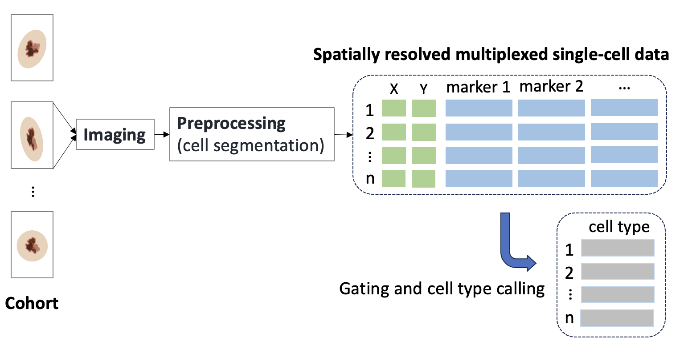

### Project Steps

#### 1. Identify a dataset

We identified a large spatially resolved, multiplexed immunofluorescence imaging data of a melanoma tissue sample at single-cell resolution. The sample contained 1,110,585 individual cells with 17 unique phenotypes. Information on cell nuclei centroids was captured as (X,Y) coordinates; data on 30 antibody markers was also included. Below are two data summaries: on the left, a table that describes phenotype counts. On the right, an example of three cells with their (X,Y) coordinates. The final figure depicts the process for gathering the data.

#### 2. Produce sketches

To explore the spatial dimensions of the dataset, we wanted to produce an (X,Y) grid of cells with their phenotypes encoded as colors.

Antibody marker data can be dimensionally reduced using techniques such as TSNE and UMAP to visualize high-level trends. 

#### 3. Streamlit implementation

Computational challenges and concerns of over-stimulating the audience led us to truncate our dataset to a random sample of 10,000 cells. Furthermore, the original 17 phenotype labels were reduced to 13 by grouping *T cells*, *Terminally Exhausted T cells*, *Partially Exhausted T cells*, *Regulatory T cells*, and *Cytotoxic T cells* under one single *T cells* category. Certain features, particularly the magnifying class and zoom-in features were deemed unnecessary. As an initial overview, we presented the user with a bar chart showing cells by phenotype to contextualize the frequencies of each phenotype. 

(X,Y) coordinates were mapped using a traditional two dimensional scatter plot. An additional color encoding specified phenotype. The user is able to interact with the chart via a dropdown menu by selecting a phenotype.

Cluster results were also depicted using a pair of scatterplots. On the left, a scatter plot of the first two dimensions of UMAP or TSNE dimensional reductions of immune marker data. Additionally, cluster assignments are encoded with another series of colors, allowing the user to study relationships between the clusters. On the right, a reproduction of the original (X,Y) coordinate scatter plot illustrates the spatial (X,Y) coordinates of clusters. Three drop down menus allow the user to select between two dimensional reduction techniques (TSNE, UMAP) and two clustering algorithms (Leiden, K-means). This selection affects the data becomes visible on the plots. There is also one last dropdown menu for the user to filter by cluster.

The final bar chart depicts the phenotype breakdown of cells within each predicted cluster. Accordingly, users can study the specificity of clustering assignments.

### Inisghts

* Tumor cells have a spatial concentration in the northwest quadrant of the the tissue sample
* Both UMAP and TSNE are well suited to identify tumor cells using Leiden and K-means clustering
* There is a dense concentration of unknown cells at the top of the sample which indicates that phenotype missingness is not at random

### Future work

Inter-phenotype cell interactions are a key source of cancer biologists' interests. A natural extension of this visualization would be a feature that allows for selection of multiple phenotypes for viewing in the (X,Y) coordinate scatter plot.

As mentioned in the streamlit implementation section, 10,000 cells were randomly sampled from the initial dataset. A visual method that facilitates plotting of larger sample sizes with dynamic zooming is another interesting future direction.

### Contribution

Max:

Lindo:

Guihong: